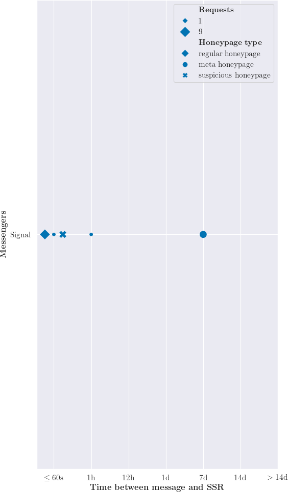

# Honeymessages Framework
## Analysis Notebook

This folder contains a Jupyter notebook that creates the `timeaccess.png` plot.
The notebook aggregates data from the framework, stores it in JSON format (analysis/out/timings)
and plots a scatterplot showing when a messenger's honeypages were accessed.

### Start Notebook

```bash
./start.sh
```

Visit [http://localhost:8889/notebooks/artifacts.ipynb?token=honey](http://localhost:8889/notebooks/artifacts.ipynb?token=honey) to interact with the notebook.
Then either look at the precomputed values or click **Run -> Run All Cells**. 
In the final cell, a plot of your data should be visible.
The plot is also stored in `out/timings/`.

### Stop Notebook

```bash
./stop.sh
```
### Plot


